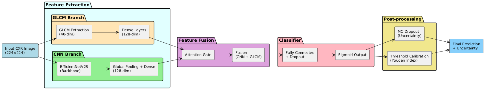
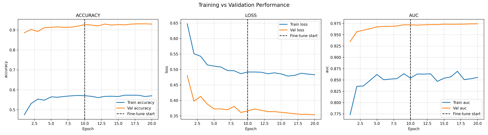
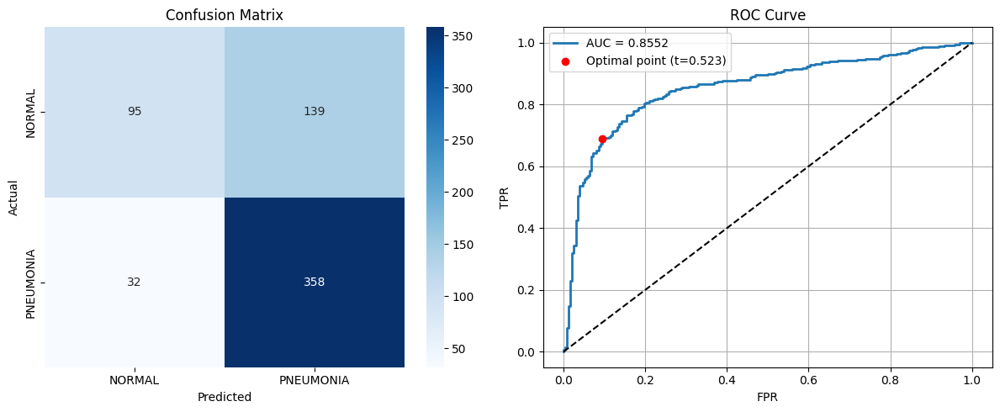
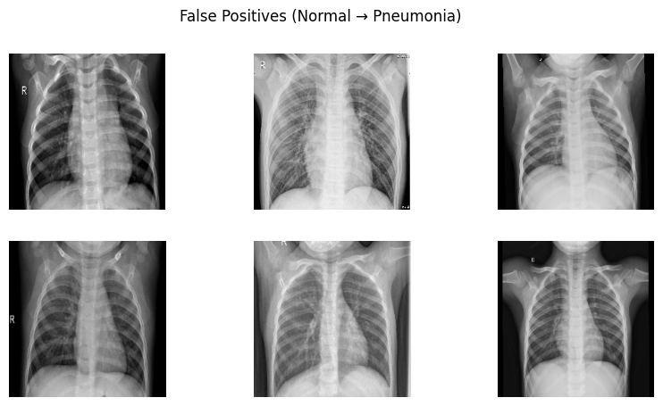
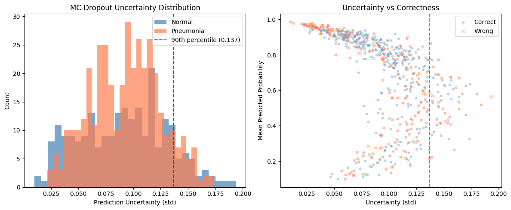
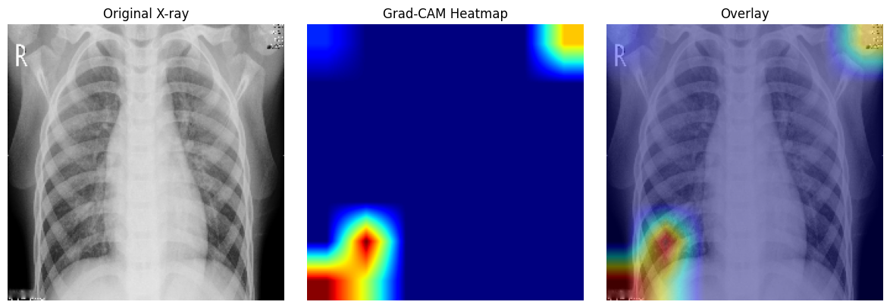
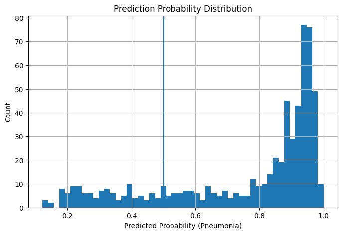

# 🫁 Pneumonia Detection from Chest X-Rays
       
## Hybrid EfficientNetV2-S + GLCM with Attention Fusion, Uncertainty Awareness, and Calibrated Decision-Making
       
*A clinically-inspired AI system focused on reliability, interpretability, and real-world deployment.*


---

## 📌 Why This Project Matters

Pneumonia causes ~2.5 million deaths annually, yet diagnosis from chest X-rays still depends heavily on human interpretation.

Even experts can disagree. Fatigue and subtle patterns make diagnosis difficult.

Most AI models focus only on accuracy.  
This project focuses on something more important:

> **Can we trust the model’s prediction?**

---

## ⭐ What Makes This Different

- 🧠 Hybrid model combining **CNN + GLCM texture features**
- 🎯 Attention mechanism learns **which features to trust**
- 📉 Threshold optimization using **Youden Index (not fixed 0.5)**
- ⚠️ Uncertainty estimation using **Monte Carlo Dropout**
- 🔍 Explainability via **Grad-CAM**

This is not just a classifier. It is a **decision-support system prototype**.

---

## 🚀 Features

- Hybrid feature fusion (CNN + GLCM)
- Attention-based adaptive weighting
- Two-stage training (freeze → fine-tune)
- Youden Index threshold calibration
- Monte Carlo Dropout uncertainty estimation
- Test-Time Augmentation (TTA)
- Logistic stacking ensemble
- Albumentations data augmentation
- Class imbalance handling
- Grad-CAM explainability
- Calibration analysis

---

## 🧠 Model Architecture
<div align="center">
      

       The model dynamically decides how much to rely on each feature type.
</div>


---

## 📊 Results

| Model | AUC | Accuracy | Sensitivity | Specificity |
|------|-----|----------|------------|------------|
| GLCM-only | 0.8080 | 0.7740 | 0.8103 | 0.7137 |
| CNN-only | 0.8524 | 0.8141 | 0.8128 | 0.8162 |
| Hybrid | 0.8552 | 0.7949 | 0.7641 | **0.8462** |
| **Ensemble** | **0.8780** | **0.8333** | **0.8282** | 0.8419 |

### Key Insights

- Hybrid improves **specificity**
- Ensemble achieves best overall performance
- Better balance between sensitivity and reliability

---

## ⚠️ Threshold Calibration

Instead of using a fixed 0.5 threshold:

- Sensitivity: **0.9141**
- Specificity: **0.9701**

This improves detection but increases false positives, reflecting real clinical trade-offs.

---

## 🧪 Pipeline Overview

1. Data preprocessing and split correction  
2. Class imbalance handling  
3. Feature extraction (CNN + GLCM)  
4. Two-stage training  
5. Test-Time Augmentation  
6. Ensemble stacking  
7. Threshold calibration  
8. Uncertainty estimation  

---

## 🔬 Key Concepts

**GLCM**  
Captures spatial texture patterns in images.

**Attention Fusion**  
Learns how much to trust CNN vs GLCM features.

**Monte Carlo Dropout**  
Runs multiple predictions to estimate uncertainty.

**Youden Index**  
Finds optimal threshold balancing sensitivity and specificity.

---

## 📸 Visual Outputs

## 📈 Training Analysis


## 📊 Results


## False Positive Rate


## ⚠️Monte Carlo Dropout and Uncertainty


## 🔍 Explainability (Grad-CAM)


## 📈 Prediction 


---

## 📁 Project Structure
```bash
pneumonia-detection/
├── notebooks/
├── assets/
├── models/
├── data/
├── requirements.txt
└── README.md
```


---

## ⚙️ Setup
```bash
git clone https://github.com/your-username/pneumonia-detection.git
cd pneumonia-detection
pip install -r requirements.txt
```
## Download Datset
```bash
jupyter notebook notebooks/Pneumoniadetection.ipynb
```

## Future Work
1. Multi-dataset evaluation
2. Better calibration methods
3. Transformer-based fusion
4. Advanced uncertainty methods
5. Multi-class classification
These are fused using an attention mechanism.

---

## 📌 Conclusion

This project demonstrates that combining deep representations with handcrafted texture features, along with proper calibration and uncertainty estimation, can lead to more reliable medical AI systems.

It highlights the importance of:
- moving beyond accuracy as the only metric  
- incorporating uncertainty into predictions  
- designing models with real-world constraints in mind  

---

<div align="center">

**Toward trustworthy and interpretable AI for healthcare.**

</div>
